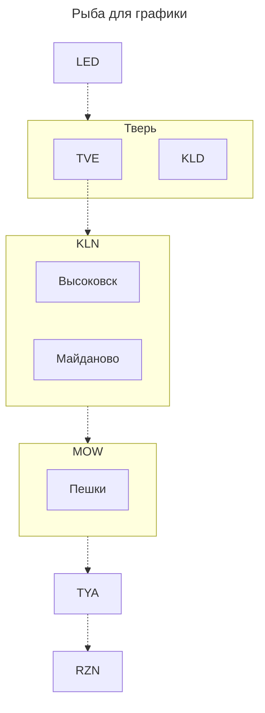
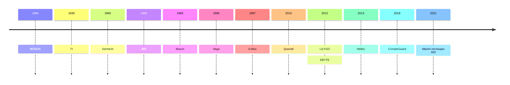

# LoRa заметки

author: Krey81 \
source: [src](https://github.com/Krey81/lora/blob/main/notes/README.md) \
tags: lora

*документ рассчитан на рендеринг средствами VSCode с плагинами. markdown и деривативы очень быстро развиваются, не все успевают*

## Частоты регионов (сортировка с севера на юг)

| Регион           | Регион (код) | Протокол   | Частота | Полоса | SF | CR  | Прочее                          | Link (предпочтительно на онлайн-карту)                                      |
| ---              | ---          | ---        | ---     | ---    | --- | --- | ---                            | ---                                                                         |
| Санкт-Петербург  | LED          | meshcore   | 868.856 | 62.5   | 7   | 7   | Хэш пути 2 байта               | https://meshcoretel.ru/ru/LED/map                                           |
| Тверь            | TVE          | meshtastic | 868.825 | 250    | 11  | 4/5 | LongFast (RU слот 1)           | https://map.onemesh.ru/?lat=56.84296616988806&lng=36.21368408203126&zoom=11 |
| Тверь            | KLD          | meshcore   | 869.169 | 62.5   | 8   | 8   | Хэш пути 1 байт                | https://meshcoretel.ru/ru/KLD/map                                           |
| Клин             | KLN          | meshtastic | 869.075 | 250    | 11  | 4/5 | LongFast (RU слот 2)           | https://map.onemesh.ru/?lat=56.34661065762104&lng=36.82479858398438&zoom=11 |
| Москва и область | MOW          | meshcore   | 868.731 | 62.5   | 7   | 7   | Хэш пути 2 байта               | https://meshcoretel.ru/ru/MOW                                               |
| Тула             | TYA          | meshcore   | 868.731 | 62.5   | 8   | 7   | Хэш пути 2 байта               | https://meshcoretel.ru/ru/TYA/map                                           |
| Рязань           | RZN          | meshcore   | 868.880 | 62.5   | 9   | 5   | Хэш пути 2 байта               | https://meshcoretel.ru/ru/RZN/map                                           |

## Запланированные связи регионов (как хотелось бы) 

## Термины

| Термин | Расшифровка | Что это простыми словами | Влияние на связь |
| :--- | :--- | :--- | :--- |
| **Chirp** | **Чирп** (от англ. *chirp* — «чириканье», «щебет») | Это сам **сигнал**. В LoRa он представляет собой радиоволну, частота которой за время одного символа плавно возрастает или убывает (от `-BW/2` до `+BW/2`). Весь смысл модуляции в том, чтобы **закодировать информацию в форме этого «чирпа»**. | Основа модуляции. Длительность одного чирпа напрямую зависит от **SF** и **BW**. |
| **SF** *(Spreading Factor)* | **Коэффициент расширения** | Определяет, **сколько бит информации кодируется в одном символе** (чирпе). Чем выше SF, тем больше бит в символе и тем дольше он длится. | **Главный регулятор дальности и скорости.** Увеличение SF **увеличивает дальность** и помехоустойчивость, но **сильно снижает скорость** передачи данных. |
| **CR** *(Coding Rate)* | **Скорость кодирования** | Это **доля полезных данных** в общем потоке. Остальная часть — это избыточные биты для **обнаружения и исправления ошибок** (Forward Error Correction, FEC). | **Влияет на надежность.** Более высокий CR (например, `4/8`) добавляет больше избыточности, что **улучшает помехоустойчивость**, но **снижает полезную скорость** передачи. |
| **BW** *(Bandwidth)* | **Ширина полосы** | Это **ширина частотного канала**, которую занимает сигнал | Увеличение BW **повышает скорость** передачи данных, но **ухудшает чувствительность** приемника, сокращая дальность. |
| IMU               |                                                   | инерциальный датчик                                                           | - |
| Dead Reckoning    | -                                                 | позиционирование при потере сигнала GNSS по данным от IMU                     | - |
| Sensor Fusion     | -                                                 | IMU + данные с датчиков приводов                                              | - |
| NMEA              | National Marine Electronics Association           | стандарт передачи данных от спутниковых приемников в виде текста              | - |
| RTK               | Real-Time Kinematic                               | технология повышения точности спутниковой навигации                           | - |
| RTCM              | Radio Technical Commission for Maritime Services  | протоколы для RTK, бинарные                                                   | - |

## Контекст, другие стандарты беспроводной связи

| Технология | Стандарт | Полоса (BW) | Модуляция | Дальность | Энергопотребление | Краткое определение |
| :--- | :--- | :--- | :--- | :--- | :--- | :--- |
| **LoRa** | **LoRa Alliance** (IEEE 1451.5.5) | 125–500 кГц | **Chirp Spread Spectrum (CSS)** | до 15 км | Очень низкое | Модуляция с линейным изменением частоты (чирп). Обеспечивает большую дальность и помехоустойчивость при низкой скорости. |
| **LoRaWAN** | **LoRa Alliance** | 125–500 кГц | **CSS** | до 15 км | Очень низкое | Сетевой протокол (MAC-уровень) для LPWAN-сетей на основе технологии LoRa. Поддерживает IP-адресацию (включая IPv6) через адаптационный уровень SCHC, что позволяет напрямую интегрировать устройства с IP-сетями и облачными сервисами |
| **Sigfox** | **Sigfox / UnaBiz** (проприетарный) | 0.1 кГц | **Ultra Narrow Band (UNB)** | до 50 км | Очень низкое | Проприетарная глобальная сеть для передачи коротких сообщений (до 12 байт) от датчиков. |
| **NB-IoT** | **3GPP** (Release 13) | 180 кГц | **QPSK, BPSK, SC‑FDMA, OFDMA** | до 15 км | Низкое | Сотовая LPWAN-технология в лицензируемом спектре для глубокого проникновения сигнала. |
| **LTE-M** (CAT-M) | **3GPP** (Release 13) | 1.4 МГц | **OFDM, SC-FDMA** | до 15 км | Низкое | Сотовая LPWAN-технология, обеспечивающая более высокую скорость и поддержку голосовых вызовов по сравнению с NB-IoT. |
| **EC-GSM-IoT** | **3GPP** (Release 13) | 200 кГц | **GMSK, 8-PSK** | до 15 км | Низкое | Технология LPWAN на основе GSM, оптимизированная для работы в существующих сетях 2G. |
| **5G NR RedCap** | **3GPP** (Release 17) | 20-100 МГц | **OFDM, SC-FDMA** | до 15 км | Среднее | Облегченная версия 5G для IoT-устройств, обеспечивающая баланс скорости, задержки и энергопотребления. |
| **Wi-Fi HaLow** | **IEEE 802.11ah** | 1–16 МГц | **OFDM** | до 1.5 км | Низкое | Версия Wi-Fi для IoT в Sub-GHz диапазонах (868/915 МГц). Обеспечивает высокую скорость и хорошую дальность. |
| **Wi-SUN** | **IEEE 802.15.4g** | 100–600 кГц | **MR-FSK, MR-OFDM** | до 1.5 км | Низкое | Открытый стандарт для «умных» сетей (Smart Utility Networks), используется в промышленности и городах. |
| **Zigbee** | **IEEE 802.15.4** | 2 МГц | **DSSS, O-QPSK** | до 100 м | Очень низкое | Открытый стандарт для недорогих, маломощных сетей с низкой скоростью. Широко используется в «умном доме». |
| **Thread** | **IEEE 802.15.4** | 2 МГц | **O-QPSK** (на основе 802.15.4) | до 100 м | Очень низкое | IPv6-протокол для энергоэффективных mesh-сетей IoT. Обеспечивает надежную маршрутизацию. |
| **Matter** | **Connectivity Standards Alliance** (прикладной уровень) | Зависит от транспорта | Зависит от транспорта | Зависит от транспорта | Низкое | Унифицированный прикладной протокол для совместимости устройств «умного дома». |
| **Bluetooth LE** | **Bluetooth SIG** (основан на IEEE 802.15.1) | 2 МГц | **GFSK** | до 100м (до 1000м режим Long Range BLE 5.0+) | Очень низкое | Версия Bluetooth, оптимизированная для сверхнизкого энергопотребления. Идеальна для периферийных устройств и носимой электроники. |
| **UWB** | **IEEE 802.15.4z** | ≥ 500 МГц | **Импульсная** | до 10–200 м | Низкое | Передача данных короткими наносекундными импульсами. Обеспечивает высокоточное позиционирование (до 10–30 см). |
| **Wi‑Fi** | **IEEE 802.11** (a/b/g/n/ac/ax/be) | 20–160 МГц | **OFDM, DSSS, QAM** | до 50 м | Высокое | Семейство стандартов для беспроводных локальных сетей (WLAN). Обеспечивает высокую скорость передачи данных. |
| **Активный RFID** | **IEEE 802.15.4f** | Зависит от реализации | **Зависит от PHY** (напр., BLE) | до 100 м | Низкое / Среднее | RFID-системы со встроенным источником питания. Обеспечивают большую дальность считывания и могут передавать данные от датчиков. |
| **Пассивный RFID** | **ISO/IEC 18000** (серия) | **LF (125 кГц), HF (13.56 МГц), UHF (860–960 МГц)** | **Load Modulation, Backscatter** | до 10 м | **Отсутствует** (питание от считывателя) | RFID-метки без собственного источника питания. Получают энергию от сигнала считывателя. Используются для идентификации. |
| **NFC** | **ISO/IEC 14443** (основа) | **13.56 МГц** | **Load Modulation** | до **4–10 см** | **Отсутствует** (питание от считывателя) | Специализированный подвид RFID для сверхближней связи (до 4–10 см). Используется для бесконтактных платежей и обмена данными. |

# Hardware

## Модули

### Среда, окружение

| Наименование  | Измеряемые параметры | Точность                       | Шина              | Описание                                                                |
| ---           | ---                  | ---                            | ---               | ---                                                                     |
| BME280        | T, H, P              | ±1.0°C, ±3% RH, ±1.0 гПа       | I2C, SPI          | 0–65°C                                                                  |
| BME680        | T, H, P, VOC         | ±0.5°C, ±3% RH, ±0.6 гПа       | I2C, SPI          | 0–65°C, для воздуха выдает рассчетный индекс *сопротивление газа*, который проприетарным алгоритмом можно типа разложить на составляющие |
| DS18B20       | T                    | ±0.5°C (-10°C...+85°C), ±2°C   | 1-Wire            |                                                                         |
| LM35          | T                    | ±0.5°C (при 25°C), ±1°C        | нет (аналоговый)  | для сравнения тут                                                       |
| RadSens       | мкР/ч                | зависит от трубки              | I2C               | Универсальный модульный дозиметр, трубки: СБМ20                         |

### Параметры тока, напряжения
| Наименование  | Измеряемые параметры | Точность                       | Шина              | Описание                                                                |
| ---           | ---                  | ---                            | ---               | ---                                                                     |
| INA260        | V, A                 | 1%                             |                   | до +36В, до 15А                                                         |

### Навигация, движение
| Наименование  | Измеряемые параметры           | Точность             | Шина              | Описание                                                                |
| ---           | ---                            | ---                  | ---               | ---                                                                     |
| MPU-9250      | гироскоп, акселерометр, компас |                      | I2C, SPI          | 9DOF Гироскоп, Акселерометр Магнетометр                                 |
| L76K          | L1                             | 2м                   | UART (NMEA)       | начальный, бюджетный                                                    |
| LC29H**       | L1/L5                          | <20см/5см + 1ppm     | UART              | семейство модулей для точной навигации с поправками, ЗАЛОЧЕНО для РФ    |
| ZED-F9*       | различается                    | 1 см + 1 ppm         | UART              | семейство модулей для точной навигации с поправками
| ZED-F9P       | L1/L2                          | -                    |                   | основной для BS + поддержка Yaw для ровера                              |
| ZED-F9R       | L1/L2/L5, IMU + Sensor Fusion  | -                    |                   | основной для ровера                                                     |

## Модемы Semtech 

| Поколение | Назначение | Модель | Частотный диапазон | Макс. мощность | Чувствительность (макс.) | Ключевая особенность |
| :---: | :--- | :--- | :--- | :---: | :---: | :--- |
| 1 | Нода (End-Node) | **SX1272** | 860–1000 МГц | +20 дБм | –137 дБм | Первое поколение, основа технологии |
| 1 | Нода (End-Node) | **SX1276** | 137–1020 МГц | +20 дБм | –148 дБм | Классическая модель, широкая совместимость |
| 1 | Нода (End-Node) | **SX1277** | 137–1020 МГц | +20 дБм | –148 дБм | Аналог SX1276 |
| 1 | Нода (End-Node) | **SX1278** | 137–525 МГц | +20 дБм | –148 дБм | Оптимизирован для Китая (470 МГц) |
| 1 | Нода (End-Node) | **SX1279** | 137–1020 МГц | +20 дБм | –148 дБм | Аналог SX1276 |
| 1 | Шлюз (Gateway) | **SX1301** | ISM bands | - | - | Первый концентратор, устаревший |
| 2 | Нода (End-Node) | **SX1261** | 150–960 МГц | +15 дБм | –148 дБм | Низкое энергопотребление (4.2 мА в приёме) |
| 2 | Нода (End-Node) | **SX1262** | 150–960 МГц | +22 дБм | –148 дБм | Современный стандарт для нод |
| 2 | Нода (End-Node) | **SX1268** | 410–810 МГц | +22 дБм | –148 дБм | Оптимизирован для Китая |
| 2 | Нода (End-Node) | **LLCC68** | 150–960 МГц | +22 дБм | –129 дБм | Бюджетный, ограниченный по функциям |
| 2 | Шлюз (Gateway) | **SX1302** | ISM bands | - | - | Малый нагрев, аппаратное ускорение |
| 2 | Шлюз (Gateway) | **SX1303** | ISM bands | - | - | SX1302 + TDoA-геолокация |
| 3 | Нода (Edge) | **LR1110** | Sub-GHz | +22 дБм | –144 дБм | Платформа LoRa Edge™, GNSS + Wi-Fi сканер |
| 3 | Нода (Edge) | **LR1120** | Sub-GHz, 2.4 ГГц, S-Band | +22 дБм (Sub-GHz) | –144 дБм | Многодиапазонный, GNSS + Wi-Fi сканер |
| 3 | Нода (Edge) | **LR1121** | Sub-GHz, 2.4 ГГц, S-Band | +22 дБм | –144 дБм | Упрощенная версия LR1120 |
| 4 | Нода (Plus) | **LR2012** | Sub-GHz | Данных нет | –141.5 дБм | Оптимизирован для Sub-GHz |
| 4 | Нода (Plus) | **LR2021** | Sub-GHz, 2.4 ГГц, S-Band | +22 дБм | –141.5 дБм | Флагман, скорость FLRC до **2.6 Мбит/с**, есть на ali |
| 4 | Нода (Plus) | **LR2022** | Sub-GHz, 2.4 ГГц | Данных нет | Данных нет | Двухдиапазонный |

# Ссылки

## Вендоры (сортировка по году основания бренда имли компании)

| Брэнд                     | Год  | Компания                                           | Страна, происхождение     | КВН  | Ссылка                                         |
| ---                       | ---  | ---                                                | ---                       | ---  | ---                                            |
| BOSCH                     | 1886 | BOSCH                                              | DE                        | +    | https://www.bosch-sensortec.com                |
| TI                        | 1930 | Texas Instruments                                  | US/TX                     | +    | https://www.ti.com                             |
| Semtech                   | 1960 | Semtech Semiconductor, Semtech Corporation         | USA/CA                    | +    | https://www.semtech.com                        |
| ADI                       | 1965 | Analog Devices, Inc.                               | US/MA                     | -    | https://www.analog.com                         |
| ~~Maxim~~                 | 1983 | ~~Maxim Integrated Products, Inc~~                 | US                        | sold | https://www.maximintegrated.com                |
| Vega                      | 1996 | Вега-Абсолют                                       | RU/NSK                    | -    | https://iotvega.com                            |
| U-blox                    | 1997 | u-blox AG                                          | CH (SWISS)                | +    | https://www.u-blox.com/                        |
| Quectel                   | 2010 | Quectel Wireless Solutions Co., Ltd.               | CN/Shanghai               | -    | https://www.quectel.com                        |
| LILYGO                    | 2012 | Shenzhen Xinyuan Electronic Technology Co., Ltd    | CN/Guangdong              | -    | https://lilygo.cc                              |
| EBYTE                     | 2012 | Chengdu Ebyte Electronic Technology Co., Ltd       | CN/Sichuan                | -    | https://www.cdebyte.com                        |
| Heltec                    | 2013 | Chengdu Heltec Automation Technology Co., Ltd      | CN/Sichuan                | +    | https://heltec.org                             |
| ClimateGuard              | 2018 | *н/д*                                              | RU/MSK                    | -    | https://climateguard.ru                        |

## Статьи

[MESHCORE — децентрализованная общественная сеть с человеческим лицом](https://habr.com/ru/articles/1056050)

[Meshcore или "связь судного дня"⁠](https://pikabu.ru/story/meshcore_ili_svyaz_sudnogo_dnya_14065427)

[Meshtastic vs. MeshCore](https://buffalora.org/2026/02/24/meshtastic-vs-meshcore)

# История изменений

| Дата       | Кратко                       | Комментарий                                                                                                   |
| ---        | ---                          | ---                                                                                                           |
| 2026-08-11 | начальная версия, рыба       | упомянул почти все, с чем сталкивался лично, зачаток структуры                                                |
| 2026-08-11 | графика                      | добавил графику для примера (граф и таймлайн), уточнил вендоров

# Контакты

Krey81 <Иванов Р.В> [@Krey81](https://t.me/krey81), krey@irinium.ru

