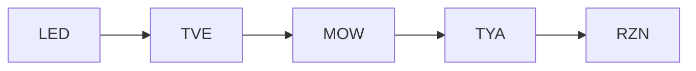
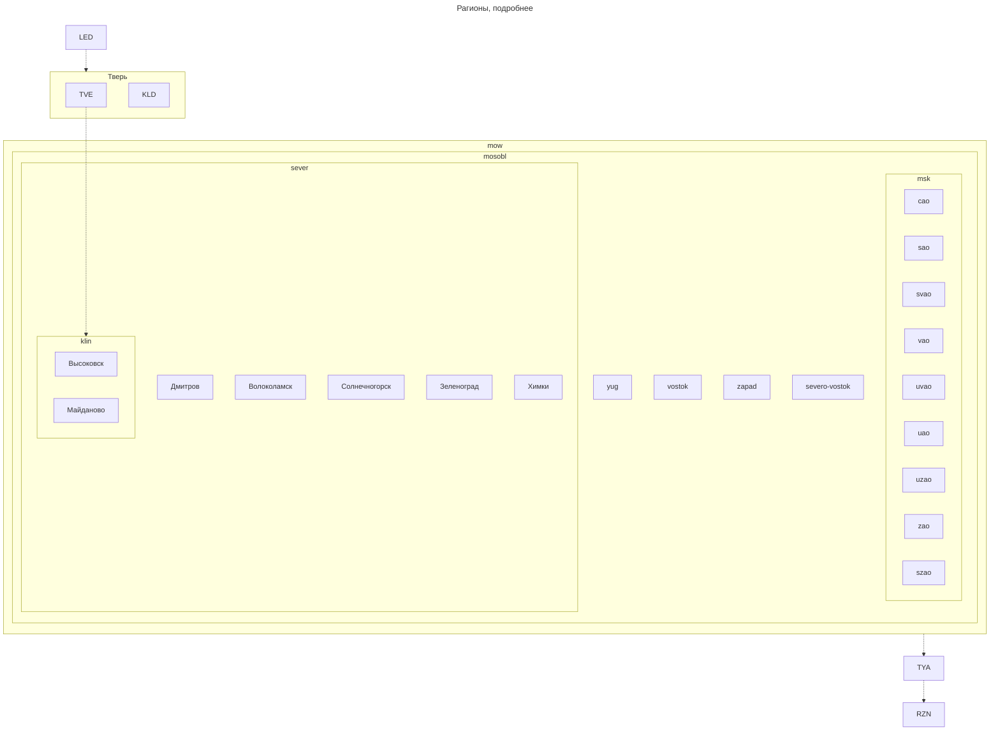
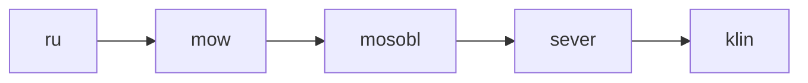
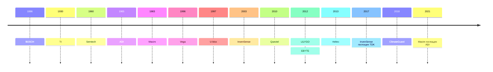

# LoRa Meshcore - заметки

author: Krey81 \
source: [src](https://github.com/Krey81/lora/blob/main/notes/README.md) - там следить за обновлениями и предлагать исправления \
tags: #lora #meshcore #meshcoretel

*документ рассчитан на рендеринг средствами VSCode с плагинами. markdown и деривативы очень быстро развиваются, не все успевают*

*Сейчас документ находится на стадии заполнения теми модулями и информацией, с которой я лично сталкиваюсь в процессе хобби или работы. Буквально беру существующую информацию из архивов или сохраненной документации, проверяю актуализацию, дополняю по гуглу или ИИ. Когда с этим закончу, переделаю структуру и уберу личное или лишнее (накопилось много, с LoRa сталкиваюсь с 2018)*

## История изменений

| № п/п | Дата       | Кратко                          | Комментарий                                                                                                 |
| ----- | ---------- | ------------------------------- | ----------------------------------------------------------------------------------------------------------- |
| 1     | 2026-08-11 | начальная версия, рыба          | упомянул почти все, с чем сталкивался лично, зачаток структуры                                              |
| 2     | 2026-08-11 | графика                         | добавил графику для примера (граф и таймлайн), уточнил вендоров                                             |
| 3     | 2026-08-11 | fix LR1 semtech                 | поправил LR1 модули semtech, добавил S, L bands                                                             |
| 4     | 2026-08-11 | bus                             | дозаполнил пропущенные поля шин                                                                             |
| 5     | 2026-08-14 | регионы мешкортеля              | добавил в граф саб-регионы mow мешкортеля                                                                   |
| 6     | 2026-08-15 | heltec v4                       | добавил информацию по heltec v4                                                                             |
| 7     | 2026-08-15 | команды                         | добавил основной список команд meshcore, очевидно, что файл нужно резать на более мелкие и менять структуру |
| 8     | 2026-08-20 | доп инфа                        | добавил инфы и фоток по железу, дополнил термины                                                            |
| 9     | 2026-08-31 | доп инфа, небольшой рефакторинг | в связи дополнением справочной информации, решил начать небольшой рефакторинг                               |
| 10    | 2026-09-03 | доп инфа T096                   | добавил инфу о Heltec T096, в связи с его доставкой                                                         |

## Отличия от Meshtastic

```
Q: Что делают пользователи Meshtastic, когда видят сообщение в LongFast? 
A: Отвечают в телеге
```

[на основе "Сравнение Meshtastic и MeshCore" от Василиск](https://boosty.to/vasilisk_lab/posts/cd5e1a00-2cdc-4a38-ae9a-322775a4dcd3)

| Характеристика | Meshtastic | Meshcore |
| -------------- | ---------- | -------- |

to be filled...


# Настройка репитера/наблюдателя
*на примере прошивки heltec_v4_repeater_mqtt-v1.16.0-vbart-meshcoretel-v1.2.0-1817248-merged.bin*

1. Включаем (или жмакаем RST) с зажатой PRG
2. Прошиваем через флешер https://meshcoretel.ru/ru/flasher
3. Сбрасываем
4. Открываем конфигуратор https://config.meshcore.io/
5. Проверяем 2-х байтовый префикс по сайту мешкортеля. Если занят выбираем другой, генерируем и прописываем новую связку ключей
6. Базовая настройка в гуе, параметры связи
     * 868.731,62.5,7,7 - для mow (meshcoretel.ru)
     * 868.800,125,8,8 - местные г. Клин
7. Дополнительная настройка в консоли

Ниже настройки в консоли

```
set name <personal>
set owner.info <personal>
set lat <personal>
set lon <personal>
set wifi.ssid <censored>
set wifi.pwd <censored>

set radio 868.731018,62.5,7,7 
set path.hash.mode 1
set tx 20
set af 1
set radio.rxgain off
set radio.fem.rxgain off
powersaving off

set loop.detect minimal
set txdelay 0.5
set direct.txdelay 0.3
set multi.acks 1
set flood.advert.interval 24
set advert.interval 60
set flood.max 7
set flood.max.unscoped 32
set flood.max.advert 16

region allowf *
region def ru mow mosobl sever klin
region home mow
region save

set mqtt.iata MOW
set mqtt.tx off

reboot

set web off

```

# Регионы

## Частоты регионов (сортировка с севера на юг)

| Регион           | Регион (код) | Протокол   | Частота | Полоса | SF  | CR  | Прочее                         | Link (предпочтительно на онлайн-карту)                                      |
| ---------------- | ------------ | ---------- | ------- | ------ | --- | --- | ------------------------------ | --------------------------------------------------------------------------- |
| Санкт-Петербург  | LED          | meshcore   | 868.856 | 62.5   | 7   | 7   | Хэш пути 2 байта               | https://meshcoretel.ru/ru/LED/map                                           |
| Тверь            | TVE          | meshtastic | 868.825 | 250    | 11  | 5   | LongFast (RU слот 1)           | https://map.onemesh.ru/?lat=56.84296616988806&lng=36.21368408203126&zoom=11 |
| Тверь            | KLD          | meshcore   | 869.169 | 62.5   | 8   | 8   | Хэш пути 1 байт                | https://meshcoretel.ru/ru/KLD/map                                           |
| Клин             | KLN          | meshtastic | 869.075 | 250    | 11  | 5   | LongFast (RU слот 2)           | https://map.onemesh.ru/?lat=56.34661065762104&lng=36.82479858398438&zoom=11 |
| Клин             | klin         | meshcore   | 868.800 | 125    | 8   | 8   | тестируем, подбираем параметры |                                                                             |
| Москва и область | MOW          | meshcore   | 868.731 | 62.5   | 7   | 7   | Хэш пути 2 байта               | https://meshcoretel.ru/ru/MOW                                               |
| Тула             | TYA          | meshcore   | 868.731 | 62.5   | 8   | 7   | Хэш пути 2 байта               | https://meshcoretel.ru/ru/TYA/map                                           |
| Рязань           | RZN          | meshcore   | 868.880 | 62.5   | 9   | 5   | Хэш пути 2 байта               | https://meshcoretel.ru/ru/RZN/map                                           |

## Регионы мешкортеля
*Пути из Санкт-Петербурга в Рязань (пофантазируем)*



[Карта регионов мешкортеля](https://yandex.ru/maps/213/moscow/?ll=37.737793%2C55.750593&mode=usermaps&source=constructorLink&um=constructor%3A973aba73f7424656857386e6b8c30fd69d3b8f82fdc54345e7284d40ad47a277&z=8)



# Термины

## Термины радиосвязи

| Термин         | Расшифровка                                      | Что это простыми словами                                                                                                                        | Влияние на связь                                                                                                                                                   |
| :------------- | :----------------------------------------------- | :---------------------------------------------------------------------------------------------------------------------------------------------- | :----------------------------------------------------------------------------------------------------------------------------------------------------------------- |
| Chirp          | Чирп (от англ. *chirp* — «чириканье», «щебет»)   | Сам сигнал. В LoRa представляет собой радиоволну, частота которой за время одного символа плавно возрастает или убывает (от `-BW/2` до `+BW/2`) | Основа модуляции. Длительность одного чирпа напрямую зависит от SF и BW                                                                                            |
| BW             | Ширина полосы *(Bandwidth)*                      | ширина частотного канала, которую занимает сигнал                                                                                               | Увеличение BW повышает скорость передачи данных, но ухудшает чувствительность приемника, сокращая дальность                                                        |
| SF             | Коэффициент расширения *(Spreading Factor)*      | Определяет, сколько бит информации кодируется в одном символе (чирпе)                                                                           | Чем выше SF, тем больше бит в символе и тем дольше он длится. Увеличение SF увеличивает дальность и помехоустойчивость, но сильно снижает скорость передачи данных |
| CR             | Скорость кодирования *(Coding Rate)*             | доля полезных данных к избыточности (Forward Error Correction, FEC)                                                                             | Более высокий CR добавляет больше избыточности, что улучшает помехоустойчивость, но снижает полезную скорость передачи                                             |
| AF             | Airtime Factor                                   | определяет время ожидания после последней передачи                                                                                              | Ожидание позволяет дать время другим участникам на передачу                                                                                                        |
| LBT            | Listen before talk                               | ожидание освобождения эфира перед передачей                                                                                                     | Позволяет избежать наложения передач и соответственно порчу сигнала и создания помех                                                                               |
| RSSI           | Received signal strength                         | уровень принятого сигнала                                                                                                                       | Чем выше, тем лучше                                                                                                                                                |
| NF             | Noise Floor                                      | уровень шума в полосе приёма (в дБм)                                                                                                            | Больше шум, хуже прием                                                                                                                                             |
| SNR            | Signal/noise ratio                               | отношение мощности полезного сигнала к мощности шума, SNR(dB) = RSSI(dBm) - NF(dBm)                                                             | Чем выше SF (коэффициент расширения), тем ниже допустимый SNR                                                                                                      |
| LNA            | Low Noise Amplifier                              | малошумящий усилитель                                                                                                                           | усиление слабых сигналов от удалённых узлов                                                                                                                        |
| TCXO           | Temperature Compensated Crystal Oscillator       | Температурно-компенсированный кварцевый генератор                                                                                               | обеспечиват стабильную опорную частоту                                                                                                                             |
| SAW            | Surface Acoustic Wave (filter)                   | Фильтр, который подавляет помехи вне рабочей полосы частот                                                                                      | делая приём более чистым                                                                                                                                           |
| FEM            | Front-End Module                                 | внешний модуль усиления сигнала в *трактах RX/TX*                                                                                               | дополнительно усиливает сигналы RX и TX и управляется программно                                                                                                   |

### Coding Rate

Доля полезных данных к избыточности (Forward Error Correction, FEC) 

например 4/7 - 4 полезных бит из 7, т.е. 3 бита избыточности для коррекции ошибок

*часть 4/ можно опустить*

### Airtime Factor

```
Duty cycle = 1 / ( 1 + AF)
AF 0 - нет ожидания
AF 1 = 50% duty cycle
AF 9 = 10% duty cycle
```

### FEM

RX: ANT → [FEM: T/R Switch → LNA] → SX1262 (внутренний LNA) → Demodulator \
TX: Demodulator → SX1262 (внутренний PA) → [FEM: PA → T/R Switch] → ANT

# Контекст, другие стандарты беспроводной связи

| Технология     | Стандарт                                             | Полоса (BW)                                     | Модуляция                    | Дальность                                    | Энергопотребление                    | Краткое определение                                                                                                                                                                                                                    |
| :------------- | :--------------------------------------------------- | :---------------------------------------------- | :--------------------------- | :------------------------------------------- | :----------------------------------- | :------------------------------------------------------------------------------------------------------------------------------------------------------------------------------------------------------------------------------------- |
| LoRa           | LoRa Alliance (IEEE 1451.5.5)                        | 125–500 кГц                                     | Chirp Spread Spectrum (CSS)  | до 15 км                                     | Очень низкое                         | Модуляция с линейным изменением частоты (чирп). Обеспечивает большую дальность и помехоустойчивость при низкой скорости.                                                                                                               |
| LoRaWAN        | LoRa Alliance                                        | 125–500 кГц                                     | CSS                          | до 15 км                                     | Очень низкое                         | Сетевой протокол (MAC-уровень) для LPWAN-сетей на основе технологии LoRa. Поддерживает IP-адресацию (включая IPv6) через адаптационный уровень SCHC, что позволяет напрямую интегрировать устройства с IP-сетями и облачными сервисами |
| Sigfox         | Sigfox / UnaBiz (проприетарный)                      | 0.1 кГц                                         | Ultra Narrow Band (UNB)      | до 50 км                                     | Очень низкое                         | Проприетарная глобальная сеть для передачи коротких сообщений (до 12 байт) от датчиков.                                                                                                                                                |
| NB-IoT         | 3GPP (Release 13)                                    | 180 кГц                                         | QPSK, BPSK, SC‑FDMA, OFDMA   | до 15 км                                     | Низкое                               | Сотовая LPWAN-технология в лицензируемом спектре для глубокого проникновения сигнала.                                                                                                                                                  |
| LTE-M (CAT-M)  | 3GPP (Release 13)                                    | 1.4 МГц                                         | OFDM, SC-FDMA                | до 15 км                                     | Низкое                               | Сотовая LPWAN-технология, обеспечивающая более высокую скорость и поддержку голосовых вызовов по сравнению с NB-IoT.                                                                                                                   |
| EC-GSM-IoT     | 3GPP (Release 13)                                    | 200 кГц                                         | GMSK, 8-PSK                  | до 15 км                                     | Низкое                               | Технология LPWAN на основе GSM, оптимизированная для работы в существующих сетях 2G.                                                                                                                                                   |
| 5G NR RedCap   | 3GPP (Release 17)                                    | 20-100 МГц                                      | OFDM, SC-FDMA                | до 15 км                                     | Среднее                              | Облегченная версия 5G для IoT-устройств, обеспечивающая баланс скорости, задержки и энергопотребления.                                                                                                                                 |
| Wi-Fi HaLow    | IEEE 802.11ah                                        | 1–16 МГц                                        | OFDM                         | до 1.5 км                                    | Низкое                               | Версия Wi-Fi для IoT в Sub-GHz диапазонах (868/915 МГц). Обеспечивает высокую скорость и хорошую дальность.                                                                                                                            |
| Wi-SUN         | IEEE 802.15.4g                                       | 100–600 кГц                                     | MR-FSK, MR-OFDM              | до 1.5 км                                    | Низкое                               | Открытый стандарт для «умных» сетей (Smart Utility Networks), используется в промышленности и городах.                                                                                                                                 |
| Zigbee         | IEEE 802.15.4                                        | 2 МГц                                           | DSSS, O-QPSK                 | до 100 м                                     | Очень низкое                         | Открытый стандарт для недорогих, маломощных сетей с низкой скоростью. Широко используется в «умном доме».                                                                                                                              |
| Thread         | IEEE 802.15.4                                        | 2 МГц                                           | O-QPSK (на основе 802.15.4)  | до 100 м                                     | Очень низкое                         | IPv6-протокол для энергоэффективных mesh-сетей IoT. Обеспечивает надежную маршрутизацию.                                                                                                                                               |
| Matter         | Connectivity Standards Alliance (прикладной уровень) | Зависит от транспорта                           | Зависит от транспорта        | Зависит от транспорта                        | Низкое                               | Унифицированный прикладной протокол для совместимости устройств «умного дома».                                                                                                                                                         |
| Bluetooth LE   | Bluetooth SIG (основан на IEEE 802.15.1)             | 2 МГц                                           | GFSK                         | до 100м (до 1000м режим Long Range BLE 5.0+) | Очень низкое                         | Версия Bluetooth, оптимизированная для сверхнизкого энергопотребления. Идеальна для периферийных устройств и носимой электроники.                                                                                                      |
| UWB            | IEEE 802.15.4z                                       | ≥ 500 МГц                                       | Импульсная                   | до 10–200 м                                  | Низкое                               | Передача данных короткими наносекундными импульсами. Обеспечивает высокоточное позиционирование (до 10–30 см).                                                                                                                         |
| Wi‑Fi          | IEEE 802.11 (a/b/g/n/ac/ax/be)                       | 20–160 МГц                                      | OFDM, DSSS, QAM              | до 50 м                                      | Высокое                              | Семейство стандартов для беспроводных локальных сетей (WLAN). Обеспечивает высокую скорость передачи данных.                                                                                                                           |
| Активный RFID  | IEEE 802.15.4f                                       | Зависит от реализации                           | Зависит от PHY (напр., BLE)  | до 100 м                                     | Низкое / Среднее                     | RFID-системы со встроенным источником питания. Обеспечивают большую дальность считывания и могут передавать данные от датчиков.                                                                                                        |
| Пассивный RFID | ISO/IEC 18000 (серия)                                | LF (125 кГц), HF (13.56 МГц), UHF (860–960 МГц) | Load Modulation, Backscatter | до 10 м                                      | Отсутствует (питание от считывателя) | RFID-метки без собственного источника питания. Получают энергию от сигнала считывателя. Используются для идентификации.                                                                                                                |
| NFC            | ISO/IEC 14443 (основа)                               | 13.56 МГц                                       | Load Modulation              | до 4–10 см                                   | Отсутствует (питание от считывателя) | Специализированный подвид RFID для сверхближней связи (до 4–10 см). Используется для бесконтактных платежей и обмена данными.                                                                                                          |

## Модуляции

| Сокращение    | Полное название                                   | Краткое описание                                                                          | Применение (системы / сигналы)                                                |
| :---          | :---                                              | :---                                                                                      | :---                                                                          |
| CW            | Continuous Wave                                   | Непрерывная волна                                                                         | Азбука Морзе, самый старый и надежный вид радиосвязи                          |
| AM            | Amplitude Modulation                              | Амплитудная модуляция                                                                     | Голосовая радиосвязь на длинных, средних волнах и в диапазоне 27 МГц (Си-Би)  |
| SSB           | Single Sideband                                   | Однополосная модуляция. Разновидность AM                                                  | Основной вид голосовой связи на коротких волнах (КВ)                          |
| LSB           | Lower SideBand                                    | Нижняя боковая полоса. Разновидность SSB                                                  | Голосовая связь на КВ-диапазонах (обычно ниже 10 МГц)                         |
| USB           | Upper SideBand                                    | Верхняя боковая полоса. Разновидность SSB                                                 | Голосовая связь на КВ-диапазонах (обычно выше 10 МГц)                         |
| FM            | Frequency Modulation                              | Частотная модуляция                                                                       | Голосовая связь на УКВ (VHF/UHF) с высоким качеством звука                    |
| WFM           | Wide FM                                           | Широкая частотная модуляция. Разновидность FM с большой девиацией частоты                 | Радиовещание с высококачественным стереозвуком на УКВ-диапазоне (FM-радио)    |
| NFM           | Narrow FM                                         | Узкая частотная модуляция. Разновидность FM с малой девиацией частоты                     | Двусторонняя радиосвязь (рации) на УКВ, где важна экономия спектра            |
| PM            | Phase Modulation                                  | Фазовая модуляция                                                                         | Используется в некоторых системах радиосвязи, реже у радиолюбителей           |
| FSK           | Frequency Shift Keying                            | Частотная манипуляция - переключения между двумя (или более) дискретными частотами        | Телеметрия, автосигнализации, RC-модели, Caller ID, радиосвязь (VLF/ELF)      |
| BFSK          | Binary Frequency Shift Keying                     | Двоичная частотная манипуляция. Частный случай FSK                                        | в простых системах передачи данных на низких скоростях                        |
| M-FSK         | M-ary Frequency Shift Keying                      | Многопозиционная частотная манипуляция                                                    | повышения скорости передачи данных, пример 4-FSK в GSM                        |
| CP-FSK        | Continuous-Phase FSK                              | Частотная манипуляция с непрерывной фазой                                                 | Используется в системах, где важна спектральная эффективность                 |
| GFSK          | Gaussian Frequency Shift Keying                   | Гауссовская частотная манипуляция                                                         | Bluetooth, LoRa, DECT, некоторые системы автоматического сбора данных         |
| GMSK          | Gaussian Minimum Shift Keying                     | Гауссовская манипуляция с минимальным частотным сдвигом                                   | 2G (GSM)                                                                      |
| AFSK          | Audio Frequency Shift Keying                      | Частотная манипуляция в звуковом диапазоне                                                | аналоговые модемы, пакетная любительская радиосвязь                           |
| 8PSK          | 8-Phase Shift Keying                              | Восьмипозиционная фазовая манипуляция                                                     | 2.5G (EDGE)                                                                   |
| 8DPSK         | 8-Differential Phase Shift Keying                 | Восьмипозиционная дифференциальная фазовая манипуляция                                    | Bluetooth 2.0+EDR                                                             |
| π/4-DQPSK     | π/4-Differential Quadrature Phase Shift Keying    | Квадратурная фазовая манипуляция с дифференциальным кодированием и сдвигом π/4            | 2G (IS-136, PDC), Bluetooth 2.0+EDR                                           |
| QPSK          | Quadrature Phase Shift Keying                     | Квадратурная фазовая манипуляция                                                          | 3G (UMTS), 4G (LTE), 5G (NR)                                                  |
| 16QAM         | 16-Quadrature Amplitude Modulation                | Квадратурная амплитудная модуляция с 16 состояниями                                       | 3G (HSPA+), 4G (LTE), 5G (NR)                                                 |
| 64QAM         | 64-Quadrature Amplitude Modulation                | Квадратурная амплитудная модуляция с 64 состояниями                                       | 3G (HSPA+), 4G (LTE), 5G (NR)                                                 |
| 256-QAM       | 256-Quadrature Amplitude Modulation               | Квадратурная амплитудная модуляция с 256 состояниями                                      | 5G (NR)                                                                       |
| 1024-QAM      | 1024-Quadrature Amplitude Modulation              | Квадратурная амплитудная модуляция с 1024 состояниями                                     | Wi-Fi 6 (802.11ax)                                                            |
| DSS           | Direct-Sequence Spread Spectrum                   | Прямая последовательность                                                                 | Wi-Fi (802.11b) для скоростей 1 и 2 Мбит/с                                    |
| CCK           | Complementary Code Keying                         | Модуляция с комплементарным кодированием. Разновидность фазовой модуляции                 | Wi-Fi (802.11b) для скоростей 5 и 11 Мбит/с                                   |
| OFDM          | Orthogonal Frequency-Division Multiplexing        | Ортогональное частотное мультиплексирование                                               | Wi-Fi (802.11a/g/n/ac/ax)                                                     |
| OFDMA         | Orthogonal Frequency-Division Multiple Access     | Множественный доступ с ортогональным частотным мультиплексированием. Развитие OFDM        | Wi-Fi 6 (802.11ax)                                                            |
| BPSK          | Binary Phase Shift Keying                         | Двоичная фазовая манипуляция с двумя состояниями фазы                                     | GPS L1/L5; Galileo E6; BeiDou B1I/B3I; SBAS L1; ГЛОНАСС G1/G2; NavIC S-band   |
| BOC           | Binary Offset Carrier                             | Двоичная смещённая несущая                                                                | Galileo E1 (частично); BeiDou B1C (BOC(1,1)); ГЛОНАСС G3                      |
| CBOC          | Composite BOC                                     | Композиционная BOC                                                                        | Galileo E1 (пилотный и канал данных)                                          |
| QMBOC         | Quadrature Multiplexed BOC                        | Квадратурная мультиплексная BOC                                                           | BeiDou B1C (пилотный компонент)                                               |
| AltBOC        | Alternate BOC                                     | Альтернативная BOC                                                                        | Galileo E5 (E5a+E5b)                                                          |
| FDMA          | Frequency Division Multiple Access                | Множественный доступ с частотным разделением                                              | ГЛОНАСС G1, G2                                                                |
| CDMA          | Code Division Multiple Access                     | множественный доступ с кодовым разделением                                                | L5, E5a, G3                                                                   |

## Спутник 📡

| Характеристика            | L-диапазон (~1.6 ГГц)                         | S-диапазон (~2 ГГц)                                           |
| :---                      | :---                                          | :---                                                          |
| Частотный диапазон        | 1–2 ГГц                                       | 2–4 ГГц                                                       |
| Проникновение             | Отличное (сквозь стены, листву)               | Хорошее (чуть хуже L-диапазона)                               |
| Скорость данных           | Низкая (10–100 кбит/с)                        | Более высокая                                                 |
| Тип трафика               | Малые, критичные пакеты (телеметрия, команды) | Более объёмные данные (FOTA, голос, изображения)          |
| Надёжность                | Максимальная (устойчив к помехам)             | Высокая (устойчив к помехам)                                  |
| Загрузка спектра          | Перегружен, получение лицензий сложнее        | Менее загружен                                                |

### L-диапазон (~1.6 ГГц)

| Сигнал / Канал                | Центральная частота, МГц  | Системы                                   | Примечания                                                        |
| :---                          | :---                      | :---                                      | :---                                                              |
| L1, E1, B1C                   | 1575.42                   | GPS, Galileo, BeiDou, QZSS, SBAS          | Основной гражданский сигнал                                       |
| L2                            | 1227.60                   | GPS, QZSS                                 | Сигнал для ионосферной коррекции и повышенной точности            |
| L5 / E5a / B2a                | 1176.45                   | GPS, Galileo, BeiDou, QZSS, SBAS, NavIC   | Новый сигнал с улучшенной помехозащищенностью; коррекция SBAS     |
| E5b / B2b                     | 1207.14                   | Galileo, BeiDou                           | Часть широкополосного сигнала E5                                  |
| E6 / L6                       | 1278.75                   | Galileo, QZSS                             | Сигнал для коммерческих и высокоточных сервисов                   |
| B1I                           | 1561.10                   | BeiDou                                    | Основной сигнал BeiDou                                            |
| B3I                           | 1268.52                   | BeiDou                                    | Сигнал для служебного и открытого использования                   |
| G1, G1a                       | 1598.06 – 1605.37         | ГЛОНАСС-М, ГЛОНАСС-К                      | Основной гражданский (SAC) и военный (PAC) диапазон               |
| G2                            | 1242.94 – 1248.63         | ГЛОНАСС-М, ГЛОНАСС-К                      | для ионосферной коррекции                                         |
| G3                            | 1191.80 – 1212.26         | ГЛОНАСС-К                                 | Новый гражданский диапазон, Аналог L5 (GPS) и E5a (Galileo)       |

## Глобальные системы позиционирования

| Наименование  | Расшифровка                                           | Происхождение                         | Начало работ | Запуск |
| :---          | :---                                                  | :---                                  | :---         | :---   |
| GPS           | Global Positioning System                             | USA                                   | 1973         | 1978   |
| ГЛОНАСС       | Глобальная навигационная спутниковая система          | СССР / Россия                         | 1976         | 1982   |
| BeiDou        | BeiDou Navigation Satellite System                    | Китай                                 | 1994         | 2000   |
| Galileo       | Galileo (имя собственное)                             | Европейский Союз                      | 1999         | 2005   |
| QZSS          | Quasi-Zenith Satellite System                         | Япония                                | 2002         | 2010   |
| NavIC         | Navigation with Indian Constellation                  | Индия                                 | 2006         | 2013   |

## Глобальные системы SBAS

| Наименование  | Расшифровка                                           | Регион                                | 
| ---           | ---                                                   | ---                                   |
| WAAS          | Wide Area Augmentation System                         | США, частично Канада, Мексика         |
| EGNOS         | European Geostationary Navigation Overlay Service     | Европа                                |
| MSAS          | MTSAT Satellite Augmentation System                   | Япония                                |
| GAGAN         | GPS Aided GEO Augmented Navigation                    | Индия                                 |
| SDCM          | Система дифференциальной коррекции и мониторинга      | Россия (на стадии развития)           |

## Системы глобальных координат

| Наименование                      | Пример               | Краткое описание                                                                                          |
| :---                              | :---                 | :---                                                                                                      |
| GNSS (WGS-84)                     | 56.8253°N, 35.9069°E | Градусы от центра сфероида                                                                                |
| QTH-локатор (Maidenhead)          | KO76WT12ab34         | делит поверхность на иерархическую сетку прямоугольников. Каждая пара символов увеличивает точность       |
| Plus Codes (Open Location Code)   | 8FVC9G8F+6X          | Смесь букв и цифр, обязательно содержит знак +                                                            |
| Geohash                           | u4pruydqqvj          | Только буквы и цифры, без +, переменная длина                                                             |


# Hardware

## LilyGo

### LilyGo T-Echo

* 2 Физических кнопки
* 1 Емкостная кнопка
* NFC
* BME280 (опционально)
* MPU-9250 (опционально) - модуль на гибком шлейфе с IMU и цифровым MEMS-микрофоном MP34DT05

General specifications

| Parameters            | Description                                                               |
| ---                   | ---                                                                       |
| MCU                   | NRF52840                                                                  |
| FLASH                 | 2MB             
| RAM                   | 2MB
| Bus Interfaces        | UART, SPI, TWI, PDM, 12S, QSPI
| Wireless Connectivity | Bluetooth 5, Thread, Bluetooth Mesh, ANT, 802.15.4, Zigbee
| LoRa Chip             | SX1262                                                                    |
| GNSS Chip             | L76K                                                                      |
| Display               | 1.54-inch SPI E-Paper Display 200x200, Grey level 2, Full refresh 2s      |
| Battery Capacity	    | 850mAh                                                                    |


### LilyGo T-Echo Plus

Это T-Echo + backpack (можно купить отдельно):

* IMU BHI260AP
* вибромотор
* пищалку
* микрофон 
* порт расширения (10-контактный разъем с шагом 2.54)
* 2400mAh аккумулятор
* 1/4-дюймовое крепление для штатива
* 2 крепежных отверстия M2 для 3D-печатных кронштейнов
* альпинистская петля (карабин)

### LilyGo T-Watch S3 Plus

General specifications

| Parameters            | Description                                 |
| --------------------- | ------------------------------------------- |
| MCU                   | ESP32-S3                                    |
| FLASH                 | 16MB                                        |
| PSRAM                 | 8MB                                         |
| LoRa Chip             | SX1262                                      |
| Wireless Connectivity | Wi-Fi: 802.11 b/g/n; BLE V5.0               |
| Microphone            | MAX98357A                                   |
| IMU                   | BMA423                                      |
| GNSS Chip             | MIA-M10Q                                    |
| Power chip            | AXP2101                                     |
| Display               | IPS 240x240                                 |
| Vibro                 | DRV2605 Haptic Driver Motor for ERM and LRA |
| Battery Capacity      | 940mAh                                      |


О прошивках 

| Метка                | ссылка                                                                                                                     |
| -------------------- | -------------------------------------------------------------------------------------------------------------------------- |
| MR1                  | https://github.com/GrayHatGuy/MeshCore/blob/feat/lilygo-twatch-s3-and-2.4ghz-lora/variants/lilygo_twatch_s3/platformio.ini |
| MR2                  | https://github.com/pelgraine/MeshCore/blob/twatch-s3-plus/variants/lilygo_twatch_s3_plus/platformio.ini                    |
| Ripple GUI: LittleFS | https://blog.meshcore.io/2026/08/14/release-1-17-1                                                                         |

## HelTec

### HelTec WiFi LoRa 32 V4

* Base on ESP32-S3(R8) & SX-1262, supports Wi-Fi b/g/n, BLE, and LoRa communication
* 2/8MB (для R8) PSRAM and 16MB external Flash
* High-power version with LoRa transmission power increased to 28±1dBm
* Form factor and pin compatibility with WiFi LoRa 32 V3
* PC casing protects the screen and integrates FPC 2.4G antenna
* SH1.25-8Pin GNSS interface
* SH1.25-2P solar panel interface
* Optimized lithium battery management
* USB Type-C interface with integrated voltage regulation, ESD protection, short-circuit protection, and RF isolation design
* Power consumption is less than 20μA

General specifications

| Parameters            | Description                                                                                                                                             |
| --------------------- | ------------------------------------------------------------------------------------------------------------------------------------------------------- |
| Master Chip           | ESP32-S3R8                                                                                                                                              |
| LoRa Chip             | SX1262                                                                                                                                                  |
| Max. TX Power         | 28±1 dBm                                                                                                                                                |
| Wi-Fi                 | 802.11 b/g/n, up to 150Mbps                                                                                                                             |
| Bluetooth             | Bluetooth LE, Bluetooth 5, Bluetooth mesh                                                                                                               |
| OLED                  | SSD1315 0.96 128*64                                                                                                                                     |
| Power Supply          | 5V@USB/Solar, 3.3-4.2V@Battery                                                                                                                          |
| Hardware Resource     | 7xADC1 + 2xADC2, 7xTouch, 3xUART, 2xI2C, 2xI2S, 4xSPI                                                                                                   |
| Memory                | 384KB ROM; 512KB SRAM; 16KB RTC SRAM; 16MB Flash; PSRAM 2/8MB( для R8)                                                                                  |
| Interface             | USB Type-C; SH1.25-2P lithium battery interface; SH1.25-2P solar panel interface; 2*IPEX1.0 ANT(LoRa&2.4G); 2*18*2.54 Header Pins, 2*2*2.54 Header Pins |
| Operating Temperature | -40~85℃(OLED operating temperature: -40~ 70°C)                                                                                                         |
| Dimensions 51.7       | 51.7 * 25.4* 10.7mm                                                                                                                                     |

### HelTec T096

Main Features

* Supports Bluetooth, LoRa, and GNSS communication
* Ultra-low power consumption
* Maximum output power of 28±1dBm, and the LNA can be bypassed
* Supports GPS, GLONASS, BDS (BeiDou), Galileo, NAVIC, and QZSS
* Integrated lithium battery management system (charge/discharge management, overcharge protection, battery power detection, automatic switching between USB and battery power)
* USB-C interface with comprehensive voltage regulation, ESD protection, short circuit protection, and RF shielding

General specifications

| Parameters            | Description                                                                                                                                        |
| --------------------- | -------------------------------------------------------------------------------------------------------------------------------------------------- |
| Master Chip           | nRF52840                                                                                                                                           |
| LoRa Chip             | SX1262                                                                                                                                             |
| GNSS Chip             | UC6580                                                                                                                                             |
| Max. TX Power         | 28±1dBm                                                                                                                                            |
| Wi-Fi                 | 802.11 b/g/n, up to 150Mbps                                                                                                                        |
| Bluetooth             | Bluetooth LE, Bluetooth 5, Bluetooth mesh                                                                                                          |
| OLED                  | ST7735S 0.96 TFT-LCD 80x160                                                                                                                        |
| Power Supply          | *уточнить* 5V@USB/Solar, 3.3-4.2V@Battery                                                                                                          |
| Hardware Resource     | USB 2.0, 2 x LEDs, 2 x Buttons, 4 x SPI, 2 x TWI, 2 x UART, 4 x PWM, QSPI, I2S, PDM, QDEC Etc7xADC1 + 2xADC2, 7xTouch, 3xUART, 2xI2C, 2xI2S, 4xSPI |
| Memory                | 1M ROM; 256KB SRAM                                                                                                                                 |
| Interface             | Type-C USB, 1.25-2P lithium battery connector, 1.25-2P solar panel connector, LoRa ANT (IPEX1.0), GNSS ANT (IPEX1.0), 2 x 13 x 2.54 Header Pin     |
| Operating Temperature | -20 ~ 70 ℃                                                                                                                                        |
| Dimensions 51.7       | 52.00*25.40*10.26 mm                                                                                                                               |

*для переключения на ipex GNSS разъем, как водится у Хелтека, нужна перепайка*

## Модули

### Среда, окружение

| Наименование  | Измеряемые параметры | Точность                       | Шина              | Описание                                                                |
| ---           | ---                  | ---                            | ---               | ---                                                                     |
| BME280        | T, H, P              | ±1.0°C, ±3% RH, ±1.0 гПа       | I2C, SPI          | 0–65°C                                                                  |
| BME680        | T, H, P, VOC         | ±0.5°C, ±3% RH, ±0.6 гПа       | I2C, SPI          | 0–65°C, для воздуха выдает рассчетный индекс *сопротивление газа*, который проприетарным алгоритмом можно типа разложить на составляющие |
| DS18B20       | T                    | ±0.5°C (-10°C...+85°C), ±2°C   | 1-Wire            |                                                                         |
| LM35          | T                    | ±0.5°C (при 25°C), ±1°C        | нет (аналоговый)  | для сравнения тут                                                       |
| RadSens       | мкР/ч                | зависит от трубки              | I2C               | Универсальный модульный дозиметр, трубки: СБМ20                         |

### Параметры тока, напряжения

| Наименование | АЦП | Точность                     | Max V | Max A       | Шина | ALERT | Корпус | Описание, особенности                     |
| ------------ | --- | ---------------------------- | ----- | ----------- | ---- | ----- | ------ | ----------------------------------------- |
| INA260       | 16  | 1%                           | 36    | 15          | I2C  | +     | TSSOP  | встроенный шунт                           |
| INA226       | 16  |                              | 36    |             | I2C  | +     | VSSOP  | внешний шунт                              |
| INA219       | 12  |                              | 26    | 3.2         | I2C  | -     | SOT-23 | внешний шунт                              |
| AXP2101      | 14  | ±0.5% (зарядка)/ ±1.5% (ток) | 5.5   | 1 (зарядка) | I2C  | +     | QFN-40 | 5x DC-DC + 11x LDO, встроенный Fuel Gauge |

#### Термины

| Термин  | Расшифровка         | Что это простыми словами                                                      |
| ------- | ------------------- | ----------------------------------------------------------------------------- |
| Monitor | шунтовый монитор    | микросхеме для измерения тока и напряжения                                    |
| PMIC    | Power Management IC | микросхема для управления питанием, зарядкой, генерацией множества напряжений |

*ALERT - Выходной сигнал*

### Движение (IMU)

| Наименование | Производитель   | Год  | Измеряемые параметры           | Шина          | Описание, особенности                                                                                                        |
| ------------ | --------------- | ---- | ------------------------------ | ------------- | ---------------------------------------------------------------------------------------------------------------------------- |
| MPU-9250     | TDK InvenSense  | 2014 | гироскоп, акселерометр, компас | I2C, SPI      | 9DOF: 3-осевой гироскоп, 3-осевой акселерометр, 3-осевой магнитометр                                                         |
| BHI260AP     | Bosch Sensortec | 2020 | AI, гироскоп, акселерометр     | I2C, SPI      | Самообучающийся AI-сенсор со встроенным IMU (6DOF: гироскоп + акселерометр)                                                  |
| BMA423       | Bosch Sensortec | 2018 | акселерометр (X, Y, Z)         | I2C, SPI      | 12 бит, низкое потребление, регулируемая полоса пропускания (8 Гц – 1.6 кГц), шагомер, детекция жестов, фильтр нижних частот |
| BMI423       | Bosch Sensortec | 2026 | гироскоп, акселерометр         | I3C, I²C, SPI | 24 бит, 6-осевой IMU, ±32g / ±4000 dps, VAD, жесты, шаги, 25 мкА, новинка CES 2026                                           |
| QMI8658      | QST             | 2021 | гироскоп, акселерометр         | I2C, SPI, I3C | 6DOF: 3-осевой гироскоп (±2048 dps) + 3-осевой акселерометр (±16g), 16 бит                                                   |

#### BHI260AP

Cистема-на-чипе (SoC) с собственным процессором, который может выполнять сложные алгоритмы без участия основного MCU, экономя энергию

| Параметр                              | Значение                                                                              |
| ---                                   | ---                                                                                   |
| Производитель                         | Bosch Sensortec                                                                       |
| Тип                                   | Самообучающийся AI-сенсор со встроенным IMU                                           |
| Встроенный IMU                        | 6DoF (3-осевой акселерометр + 3-осевой гироскоп)                                      |
| Разрядность IMU                       | 16 бит                                                                                |
| Встроенный MCU                        | 32-битный, программируемый пользователем                                              |
| Ядро CPU                              | ARC EM4 (до 3.6 CoreMark/МГц)                                                         |
| Память                                | 256 кБ SRAM, 144 кБ ROM                                                               |
| Интерфейсы Основной                   | SPI или I²C (до 3.4 МГц)                                                              |
| Дополнительные                        | 3 мастер-интерфейса (SPI/I²C), QSPI для внешней flash, до 25 GPIO                     |
| Напряжение питания	                | 1.8 В                                                                                 |
| Потребление Long Run (20 МГц)         | 950 мкА                                                                               |
| Потребление Turbo (50 МГц)            | 2.8 мА                                                                                |
| Потребление Standby                   | 8 мкА                                                                                 |
| Корпус	                            | LGA-44 (3.6 × 4.1 × 0.83 мм)                                                          |
| AI                                    | фитнес-трекинг, анализ плавания, PDR (пешеходная навигация), определение ориентации   |

#### Термины

| Термин         | Расшифровка               | Что это простыми словами                                                           |
| :------------- | :------------------------ | :--------------------------------------------------------------------------------- |
| IMU            | Inertial measurement unit | инерциальный датчик                                                                |
| VAD            | Voice Activity Detection  | через костную проводимость — активирует микрофон только когда пользователь говорит |
| Dead Reckoning | -                         | позиционирование при потере сигнала GNSS по данным от IMU                          |
| Sensor Fusion  | -                         | IMU + данные с датчиков приводов                                                   |

### Навигация

| Чип      | Каналы                        | Точность         | Интерфейсы и шины                             | Комментарий, краткое описание                                        |
| -------- | ----------------------------- | ---------------- | --------------------------------------------- | -------------------------------------------------------------------- |
| L76K     | L1                            | 2м               | UART, NMEA                                    | начальный, бюджетный                                                 |
| LC29H    | L1/L5                         | <20см/5см + 1ppm | UART, NMEA, RTCM V2                           | семейство модулей для точной навигации с поправками, ЗАЛОЧЕНО для РФ |
| ZED-F9P  | L1/L2                         | 1 см + 1 ppm     | UART, NMEA, RTCM V2                           | основной для BS + поддержка Yaw для ровера                           |
| ZED-F9R  | L1/L2/L5, IMU + Sensor Fusion | 1 см + 1 ppm     | UART, NMEA, RTCM V2                           | основной для ровера                                                  |
| UC6580   | L1/L2/L5, SBAS                | H 1.5м, V 2.5м   | UART, SPI, I2C, NMEA-0183, Unicore, RTCM V3.X | новый мультисистемный модуль с поправками по спутнику                |
| MIA-M10Q | L1                            | 1.5м             | UART, I2C                                     | Сверхкомпактный SiP-модуль 4.5x4.5 мм                                |

#### Термины навигации

| Термин | Расшифровка                                      | Что это простыми словами                                                         |
| :----- | :----------------------------------------------- | :------------------------------------------------------------------------------- |
| NMEA   | National Marine Electronics Association          | стандарт передачи данных от спутниковых приемников в виде текста                 |
| SBAS   | Satellite-Based Augmentation System              | спутниковая система дифференциальной коррекции                                   |
| PPP    | Precise Point Positioning                        | Использует спутниковую передачу (как SBAS), но с более точными орбитами и часами |
| SSR    | State Space Representation                       | Передаёт поправки через спутник (как SBAS), но в формате, приближенном к RTK     |
| RTK    | Real-Time Kinematic                              | технология повышения точности спутниковой навигации                              |
| RTCM   | Radio Technical Commission for Maritime Services | протоколы для RTK, бинарные                                                      |
| SAC    | Standard Accuracy Code                           | стандартный сигнал для всех гражданских пользователей                            |
| PAC    | Pinpoint Accuracy Code                           | высокоточный сигнал для военных и авторизованных пользователей                   |

## Модемы Semtech 

| Поколение | Назначение        | Модель | Частотный диапазон               | Макс. мощность    | Чуйка         | Ключевая особенность                                      |
| :---:     | :---              | :---   | :---                             | :---:             | :---:         | :---                                                      |
| 1         | Нода (End-Node)   | SX1272 | 860–1000 МГц                     | +20 дБм           | –137 дБм      | Первое поколение, основа технологии                       |
| 1         | Нода (End-Node)   | SX1276 | 137–1020 МГц                     | +20 дБм           | –148 дБм      | Классическая модель, широкая совместимость                |
| 1         | Нода (End-Node)   | SX1277 | 137–1020 МГц                     | +20 дБм           | –148 дБм      | Аналог SX1276                                             |
| 1         | Нода (End-Node)   | SX1278 | 137–525 МГц                      | +20 дБм           | –148 дБм      | Оптимизирован для Китая (470 МГц)                         |
| 1         | Нода (End-Node)   | SX1279 | 137–1020 МГц                     | +20 дБм           | –148 дБм      | Аналог SX1276                                             |
| 1         | Шлюз (Gateway)    | SX1301 | ISM bands                        |                   |               | Первый концентратор, устаревший                           |
| 2         | Нода (End-Node)   | SX1261 | 150–960 МГц                      | +15 дБм           | –148 дБм      | Низкое энергопотребление (4.2 мА в приёме)                |
| 2         | Нода (End-Node)   | SX1262 | 150–960 МГц                      | +22 дБм           | –148 дБм      | Современный стандарт для нод                              |
| 2         | Нода (End-Node)   | SX1268 | 410–810 МГц                      | +22 дБм           | –148 дБм      | Оптимизирован для Китая                                   |
| 2         | Нода (End-Node)   | LLCC68 | 150–960 МГц                      | +22 дБм           | –129 дБм      | Бюджетный, ограниченный по функциям                       |
| 2         | Шлюз (Gateway)    | SX1302 | ISM bands                        |                   |               | Малый нагрев, аппаратное ускорение                        |
| 2         | Шлюз (Gateway)    | SX1303 | ISM bands                        |                   |               | SX1302 + TDoA-геолокация                                  |
| 3         | Нода (Edge)       | LR1110 | Sub-GHz                          | +22 дБм           | –144 дБм      | Геолокация (GNSS + Wi-Fi)                                 |
| 3         | Нода (Edge)       | LR1120 | Sub-GHz, 2.4 ГГц, S-Band         | +22 дБм           | –144 дБм      | Глобальная геолокация (GNSS + Wi-Fi + спутник S-band)     |
| 3         | Нода (Connect)    | LR1121 | Sub-GHz, 2.4 ГГц, S-Band, L-Band | +22 дБм           | –144 дБм      | Мультидиапазонный трансивер  (S+L)                        |
| 4         | Нода (Plus)       | LR2012 | Sub-GHz                          |                   | –141.5 дБм    | Оптимизирован для Sub-GHz                                 |
| 4         | Нода (Plus)       | LR2021 | Sub-GHz, 2.4 ГГц, S-Band         | +22 дБм           | –141.5 дБм    | Флагман, скорость FLRC до 2.6 Мбит/с, есть на ali         |
| 4         | Нода (Plus)       | LR2022 | Sub-GHz, 2.4 ГГц                 |                   |               | Двухдиапазонный                                           |

# Справочник настроек MeshCore

## Устройство (управление, информация)

| Команда               | Действие                              | Описание                                                                              |
| ---                   | ---                                   | ---                                                                                   |
| name                  | наименование устройства               | 23 байта с указанием локации, 31 без локации                                          |
| owner.info            | информация о владельце устройства     | пайп '|' для перевода строки                                                          |
| role                  | роль устройства                       |                                                                                       |
| reboot                | перезагрузка (reset)                  | перезагружает устройство в нормальный операционный режим                              |
| poweroff, shutdown    | выключение                            | завершение работы, прекращение подачи питания (уход в глубокий сон)                   | 
| ver                   | информация о версии                   | версия прошивки, прочее                                                               |
| board                 | информация о железе                   | наименование, прочее                                                                  |
| powersaving           | режим энергосбережения                | on/off только для Репитеров (и производных) - устройство спит между передачами        |
| adc.multiplier        | калибровка батареи                    | коэффициент 0.0-10.0                                                                  |

## Время

| Команда               | Действие                              | Описание                                                                              |
| ---                   | ---                                   | ---                                                                                   |
| clkreboot             | Reset the clock and reboot            |                                                                                       |
| clock sync            | Sync the clock with the remote device |                                                                                       |
| clock                 | возвращает текущее время в UTC        |                                                                                       |
| time <epoch_seconds>  | установка времени                     | Unix epoch time                                                                       |
| gps sync              | установка времени по GPS приемнику    | установка времени устройства по внутреннему GPS(GNSS) приемнику                       |

## Радио

| Команда               | Действие                              | Описание                                                                              |
| ---                   | ---                                   | ---                                                                                   |
| radio                 | параметры частоты и модуляции         | <freq>,<bw>,<sf>,<cr>                                                                 |
| tempradio             | тоже, но на заданное время            | <freq>,<bw>,<sf>,<cr>,<timeout_mins> удобно для экспериментов, что бы не терять связь |
| freq                  | частота                               | MHz                                                                                   |
| dutycycle             | скважность на передачу                | (1-100) проценты                                                                      |
| af                    | ожидание после передачи               | сек (0-9), Airtime factor                                                             |
| radio.rxgain          | усиление приема в LNA модема          | для SX12xx and LR1110, v1.14.1+                                                       |
| radio.fem.rxgain      | усиление приема в FEM устройства      | on/off                                                                                |
| rxdelay               | задержка приема                       | сек (0-20), ожидание приема дублей пакета от более сильного источника                 |
| tx                    | мощность на передачу                  | dBm                                                                                   |
| radio.fem.txgain      | усиление передачи в FEM устройства    | on/off                                                                                |
| txdelay               | задержка передачи транзитных пакетов  | коэффициент, дефолт 0.5                                                               | 
| direct.txdelay        | задержка передачи директ-пакетов      | коэффициент, дефолт 0.2                                                               | 
| int.thresh            | порог интерференции                   | коэффициент, дефолт 0.0                                                               |
| cad                   | слушать канал перед отправкой         | on/off                                                                                |
| agc.reset.interval    | AGC Reset Interval                    | в секундах, кратно 4                                                                  |
| multi.ack             | Multi-Acks                            | 0-выкл, 1 вкл, дефолт 0                                                               |

## Анонсы

| Команда               | Действие                              | Описание                                                                              |
| ---                   | ---                                   | ---                                                                                   |
| advert                | отправить flood-анонс                 | отправляет анонс всем, кто услышет с дальнейшем распространением по сети              |
| advert.zerohop        | отправить анонс без распространения   | отправляет анонс всем, кто услышет                                                    |
| flood.advert.interval | анонсирование с распостранением       | часы (3-168), интервал анонсирования с распространением по сети                       |
| advert.interval       | анонсирование без распространения     | минуты (60-240), кратно 2                                                             |
| flood.max.advert      | макс хопов для объявления             | 0-64, default 8                                                                       |

## Исследование сети

| Команда               | Действие                              | Описание                                                                              |
| ---                   | ---                                   | ---                                                                                   |
| discover.neighbors    | ищет прямых соседей                   | отправляет широковещательный запрос информации ко всем, кто услышит, без пересылки    | 
| neighbors             | информация об известных соседях       | возвращает несколько последних услышанных анонсов                                     | 
| neighbor.remove       | удаляет из памяти запись о соседе     | аргумент <pubkey_prefix>                                                              |

## Локация

| Команда               | Действие                              | Описание                                                                              |
| ---                   | ---                                   | ---                                                                                   |
| lat                   | широта                                | Десятичные градусы                                                                    |
| lon                   | долгота                               | Десятичные градусы                                                                    |
| gps                   | внутренний приемник GNSS              | gps - статус, on/off                                                                  |
| gps sync              | установка времени по GPS приемнику    | установка времени устройства по внутреннему GPS(GNSS) приемнику                       |
| gps setloc            | установка позиции устройства по GPS   | установка позиции устройства по текущим координатам от модуля GPS (GNSS)              |
| gps advert            | политика распространения координат    | none, share, prefs                                                                    |


## Маршрутизация и регионы

*Регионы в MeshCore позволяют пользователю задавать область доставки широковещательных сообщений, чтобы они достигали только нужных узлов сети. Это снижает нагрузку на ретрансляторы, уменьшает расход ограниченного эфирного ресурса и повышает эффективность сети. В результате репитеры остаются более доступными, а сеть обслуживает больше пользователей без лишних задержек и перегрузок.*

**Принцип действия:** Вместо того чтобы сообщение транслировалось по всей необъятной сети до достижения лимита «прыжков» (hop limit), оно снабжается специальным региональным тегом в заголовке пакета. Репитеры (repeaters) пересылают сообщение дальше только в том случае, если их конфигурация явно разрешает работу с данным регионом. Если область не выбрана (или задан символ *), сообщение считается глобальным и пересылается всеми ретрансляторами для обеспечения обратной совместимости.


| Команда               | Действие                              | Описание                                                                              |
| ---                   | ---                                   | ---                                                                                   |
| repeat                | включает или выключает пересылку      |                                                                                       |
| path.hash.mode        | длина префикса пути                   | 0 = 1 байт, 1 = 2 байта, 2 = 3 байта                                                  |
| loop.detect           | уровень детеккции петель              | off, minimal, strict                                                                  |
| flood.max.unscoped    | макс хопов для флуда без региона      | 0-64                                                                                  |
| flood.max             | макс хопов для флуда с регионом       | 0-64                                                                                  |
| flood.max.advert      | макс хопов для объявления             | 0-64, default 8                                                                       |
| region allowf         | разрешить флуд для указанного региона | region allowf <name>, name - регион или * для всех                                    |
| region denyf          | запретить флуд для указанного региона | region denyf <name>,  name - регион или * для всех                                    |
| region get            | получить информацию по региону        | region get <name>                                                                     |
| region home           | установка домашнего региона           | region home <name>                                                                    |
| region default        | установка региона по-умолчанию        | region default {name|<null>}                                                          |
| region put            | указание нового региона               | region put <name> [parent_name]                                                       |
| region remove         | удаление региона                      | region remove <name>                                                                  |
| region def            | указание регионов ноды                | указание вложенности регионов устройства одной строкой (вместо множества команд put)  | 
| region                | получить конфигурации регионов        |                                                                                       |
| region load           | массовая загрузка регионов            | region load <name> flood_flag                                                         |
| region save           | сохранение конфигурации регионов      | сохранение изменений в конфигурации регионов с момента загрузки                       |
| region list           | получение списка регионов устройства  | region list <filter>, filter: allowed|denied                                          |

пример настройки репитера для г. Клин

```
> region
* F
 ru F
  mow^ F
   mosobl F
    sever F
     klin F
```



### Ссылки

[Про регионы (MSK - Беспорядочные связи)](https://t.me/meshcore_rulang/112770)

[Про регионы (meshcore-русскоязычное сообщество)](https://wiki.ionode.ru/regions_setup.md)

[Про регионы (на сайте документации мешкора)](https://docs.meshcore.io/cli_commands/#region-management-v110)


## Сенсоры

| Команда               | Действие                              | Описание                                                                              |
| ---                   | ---                                   | ---                                                                                   |
| sensor list           | возвращает список сенсоров            | sensor list [start], start default 0, ret key-value                                   |
| sensor get            | значение сенсора                      | sensor get <key> - sensor set <key> <value>                                           |

## Метрики

| Команда               | Действие                              | Описание                                                                              |
| ---                   | ---                                   | ---                                                                                   |
| clear stats           | очистка метрик                        | забываем все, что было и начинаем вести новые отсчеты с нуля                          |
| stats-core            | системная статистика                  | батарея, время работы, длина очередей и флаги                                         |
| stats-radio           | статистика эфира                      | уровень шума, последний RSSI/SNR, время работы в эфире, ошибки                        | 
| stats-packets         | статистика пакетов                    | кол-во принятых и отправленных пакетов                                                |

## Журналы (логирование)

| Команда               | Действие                              | Описание                                                                              |
| ---                   | ---                                   | ---                                                                                   |
| log start             | начинает запись принятых пакетов      | нужно хранилище для записи (SD-карта)                                                 |
| log stop              | останавливает запись                  |                                                                                       |
| log erase             | стирает журнылы                       |                                                                                       |
| log                   | выводит в терминал записи журналов    |                                                                                       |

## Аутентификация и права

| Команда               | Действие                              | Описание                                                                              |
| ---                   | ---                                   | ---                                                                                   |
| public.key            | публичная часть ключа                 | (hex)                                                                                 |
| prv.key               | приватная часть ключа                 | 64 шеснадцатиричных знака (hex)                                                       |
| password              | установка пароля администратора       |                                                                                       |
| guest.password        | установка гостевого пароля            |                                                                                       |
| setperm               | установка ACL                         | setperm <pubkey> <permissions>                                                        |
| get acl               | текущий ACL                           | посмотреть текущий список доступа                                                     |


## Прошивка

| Команда               | Действие                              | Описание                                                                              |
| ---                   | ---                                   | ---                                                                                   |
| start ota             | обновление прошивки по-воздуху        | обновление прошивки путем передачи файла                                              |
| erase                 | сброс настроек                        | стирает все настройки, возврат к заводскому состоянию                                 |

## Bridge (When bridge support is compiled in)

- не попадались

## Ethernet (when Ethernet support is compiled in)

- не попадались

## Вендоры (сортировка по году основания бренда имли компании)

| Брэнд                     | Год  | Компания                                           | Страна, происхождение     | КВН  | Ссылка                                         |
| ---                       | ---  | ---                                                | ---                       | ---  | ---                                            |
| BOSCH                     | 1886 | BOSCH                                              | DE                        | +    | https://www.bosch-sensortec.com                |
| TI                        | 1930 | Texas Instruments                                  | US/TX                     | +    | https://www.ti.com                             |
| TDK                       | 1935 | TDK Corporation                                    | JP/Tokyo                  | -    | https://www.tdk.com                            |
| Semtech                   | 1960 | Semtech Semiconductor, Semtech Corporation         | USA/CA                    | +    | https://www.semtech.com                        |
| ADI                       | 1965 | Analog Devices, Inc.                               | US/MA                     | -    | https://www.analog.com                         |
| ~~Maxim~~                 | 1983 | ~~Maxim Integrated Products, Inc~~                 | US                        | sold | https://www.maximintegrated.com                |
| Vega                      | 1996 | Вега-Абсолют                                       | RU/NSK                    | -    | https://iotvega.com                            |
| U-blox                    | 1997 | u-blox AG                                          | CH (SWISS)                | +    | https://www.u-blox.com/                        |
| TDK InvenSense            | 2003 | InvenSense, Inc ((TDK Group))                      | USA/CA                    | +    | https://invensense.tdk.com                     |
| Quectel                   | 2010 | Quectel Wireless Solutions Co., Ltd.               | CN/Shanghai               | -    | https://www.quectel.com                        |
| LILYGO                    | 2012 | Shenzhen Xinyuan Electronic Technology Co., Ltd    | CN/Guangdong              | -    | https://lilygo.cc                              |
| EBYTE                     | 2012 | Chengdu Ebyte Electronic Technology Co., Ltd       | CN/Sichuan                | -    | https://www.cdebyte.com                        |
| QST                       | 2012 | QST Corporation)                                   | CN/Shanghai               | -    | https://www.qstcorp.com                        |
| Heltec                    | 2013 | Chengdu Heltec Automation Technology Co., Ltd      | CN/Sichuan                | +    | https://heltec.org                             |
| ClimateGuard              | 2018 | *н/д*                                              | RU/MSK                    | -    | https://climateguard.ru                        |



## Статьи

[MESHCORE — децентрализованная общественная сеть с человеческим лицом](https://habr.com/ru/articles/1056050)

[Meshcore или "связь судного дня"⁠](https://pikabu.ru/story/meshcore_ili_svyaz_sudnogo_dnya_14065427)

[Meshtastic vs. MeshCore](https://buffalora.org/2026/02/24/meshtastic-vs-meshcore)

[CLI commands](https://docs.meshcore.io/cli_commands)

# Контакты

Krey81 <Иванов Р.В> [@Krey81](https://t.me/krey81), krey@irinium.ru

## Мои ноды

| Протокол  | Hex       | Name              | Тип          | Description                                        |
| --------- | --------- | ----------------- | ------------ | -------------------------------------------------- |
| meshcore  | AABD4C98  | Krey81-echo       | Мобильный    | Компаньон LILYGO T-Echo                            |
| meshcore  | EEEF2054  | Krey81-t096       | Мобильный    | Компаньон Heltec T096                              |
| meshcore  | 09739C3E  | MO Golikovo-1 360 | Стационарный | Наблюдатель рядом с д. Голиково (Клин)             |
| meshtasic | !3a38239a | MO Golikovo-2 360 | Стационарный | CLIENT-BASE, рядом с д. Голиково (Клин), временный |
| meshtasic | !9fce2178 | Krey81-h4r8       | Мобильный    | CLIENT-MUTE, временный                             |


