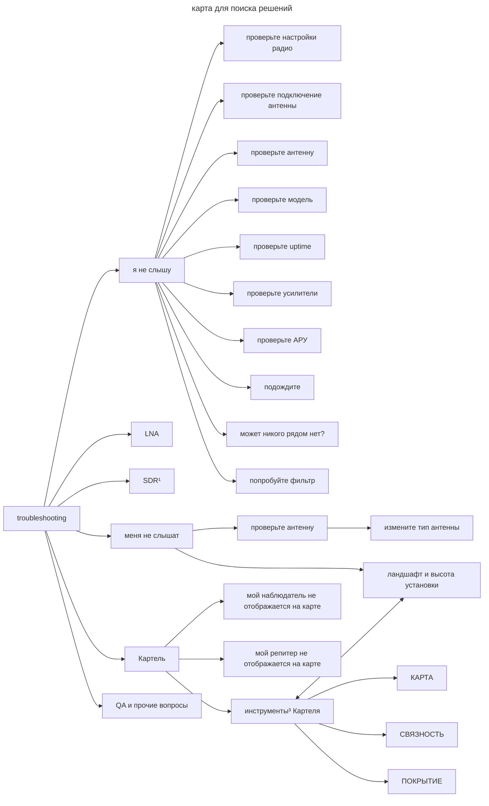

# Поиск неисправностей

пока это рыба, как и все в этом репозитории...

термины есть в рядом в readme...

# На прием

## Мой репитер ничего не слышит

### 1. Проверьте настройки радио (FQ, BW, SF)

- по картелю для вашего региона
- по чатам
- по интернет карте

### 2. Проверьте подключение антенны

- в некоторых железках есть несколько разъемов для антенн. Возможно вы воткнули антенну для LoRa в разъем для WiFi\BLE\GNSS
- проверьте физически контакт
  - возможно вы перепутали типы гнезд или использовали неправильные переходники, например male\female, тип ipex итп
  - возможно разьем антенны закрашен внутри (встречается на гибких антеннах типа гизонта)
- если антенна меняет угол у разъема, используйте только прямой сетап 

### 3. Проверьте модель

Возможно под видом 866 вам прислали модель на 433

### 4. Проверьте аптайм

Возможно при приеме входящего сигнала и последующей ретрансляции ваш репитер\наблюдатель уходит в ребут

*Например (спасибо **@ELPIKOO**) на длинных линиях питания спарка от vbart 0.16 для heltec без установки wifi.powersaving* \
*в этом случае discover.neighbors с высокой вероятностью отправит железку в ребут*

- улучшить линию питания
- прейти на PoE
- поставить кондер

### 5. Проверьте и\или замените антенну

для проверки антенны нужен векторный анализатор (например nanoVNA), если его нет просто попробуйте другую

- антенна не на ту частоту
- параметры антенны далеки от ожидаемых

### 6. Проверьте параметры усиления на прием

При включении усиления в идеале одинаково усиливается шум и полезный сигнал, на практике шум усиливается сильнее

Попробуйте последовательно включать усилители на прием

- все выключены
- включен усилитель в модеме (radio.rxgain)
- включен усилитель в fem (radio.fem.rxgain)

### 7. Проверьте глухоту репитера

Если NF на вашей репе равен ее минимальному значению (например -120 для хелтека в4) скорее всего ваш реп оглох от сильного сигнала рядом. Это может быть сотовая БС или ваш собственный компаньон

- сначала вам поможет автоматический сброс АРУ (agc.reset.interval)
- далее нужно устранять проблему
  - в случае компаньона, снижение уровня его tx 
  - в случае чужой помехи, используйте фильтры в тракте

### 8. Просто подождите

Возможно ваши запросы не доходят ни до одного репитера, в этом случае нужно просто дождаться входящих адвертов

*(!) вопросы отсылки в секции приема не поднимаем - неправильная антенна теоритически может сжечь передатчик в железке* \
*(!) по дефолту реп автоматически шлет адверт после ребута и далее по графику. Поэтому включать железку без антенны крайне не рекомендуется*

- в msk более часа ждать вряд-ли стоит
- в глухой деревне не стоит ждать более 2х суток

### 9. Может никого рядом нет? И ловить нечего...

попробуйте временно прошиться на мештастик

но имейте ввиду что в мештастике нет функции discovery. Вы увидите ноду тастика только когда она что-то отправляет

### 10. Добавьте полосовой фильтр *(задача со звездочкой)*

- в идеале этот пункт лучше начинать с SDR¹, но, если его нет (и одолжить не у кого)
- можно прикупить (или одолжить на пробу) фильтр

# На отправку

## Мой репитер никто не слышит

Это обычное дело для новичков. Самое важное это антенна, высота ее установки и окружающий ландшафт

### 1. Проверьте антенну

*(!)Комплектные антенны типа лгбт или пипок-окурков за антенны не считаются. Среди них попадаются хорошо настроенные, но это большая редкость*

В идеале для проверки антенны нужен векторный анализатор вроде nanoVNA. Им вы сможете проверить

- КСВ
- Волновое сопротивление 
- Резонанс 

### 2. Смените тип антенны

- если ваш реп кого-то слышит, это в большей степени заслуга антенны передающей репы, а не вашей приемной
- задача антенны - сфокусировать сигнал в правильном направлении
- идеальная антенна в идеальных условиях - *ненаправленная* или точнее с диаграммой направленности в виде бублика (тора)
- но если вы ограниченны ландшафтом или дальностью стоит рассмотреть *направленные* типы антенн

краткая сводка по типам антенн

* ненаправленные
  * штырь
  * диполь
  * коллинеар
* направленные
  * moxon
  * харченко
  * яга
  * зеркальная

### 3. Ландшафт и высота установки

- чем выше тем лучше, но есть достаточная высота для связи между двумя точками, определяемая физикой распространения сигнала
- рассчетный² SNR для LoRa
- зона Френеля³
- прочее и временное
  - редкие погодные условия
  - отражения от самолетов
   
# Мешкортель

## Мой наблюдатель не отображается на карте

- проверьте настройку IATA
- удостоверьтесь что на сайте выбран соответствующий регион
- проверьте статус подключения MQTT
- проверьте статус наблюдателя на сайте в разделе НАБЛЮДАТЕЛИ

## Мой репитер не отображается на карте

Репитер отображается на карте, если

- его слышит хотя бы один наблюдатель (или репитер совмещен с наблюдателем)
- у репитера есть связность (наблюдатель фиксирует принятый адверт от другого репитера)

просмотрите и сделайте выводы по разделам сайта 
- КАРТА
- СВЯЗНОСТЬ
- ПОКРЫТИЕ

# Сноски

1. SDR - в этом качестве может выступать и сама лора-железка, например на базе ESP32 с некоторыми прошивками
2. <TODO> Ссылка на калькулятор SNR
3. Зона Френеля, распространение сигнала и планирование размещения репитера

# QA, прочие вопросы

Q> Можно ли сжечь трансивер включая его без антенны?
A> Таких фактов не встречалось, но просто заведите себе правило не включать передатчики без подключенной антенны

## Время на репитере

Потеря актуальности времени репитером не влияет на функционал пересылки пакетов, но доставляет неудобства

- лично вам 
  - в GUI
  - всяких графиках и статистиках
- другим при анализе на мешкортеле

точное время репитер может иметь только если он наблюдатель (спарка), получая его по NTP

- RTC модуль дрейфует
- GNSS спуфят иногда через время

## Закон РФ

Вопросы регламентирования использования ISM-диапазона

* 433
* 868

